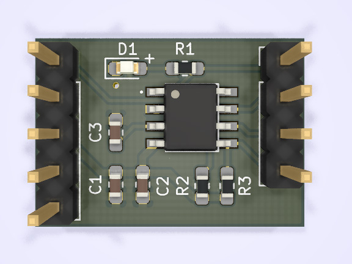

# STM8S001J3 tiny board

A tiny dev board for STM8S001J3 MCU designed in KiCad. 

The board has the LED (D1) that is connected to pin #1 of the MCU and two (optional) pull-up resistors for the I²C bus.

## Pinout

Left connector | Right connector
--- | ---
SWIM | PA1, PD6, LED
VDD | PC3, PC4, PC5
VDD | PB4, I2C SCL
GND | PA3, PB5, I2C SDA

> *seen from the front*

## License
This project is licensed under the MIT License - see the [LICENSE](/master/LICENSE) file for details.